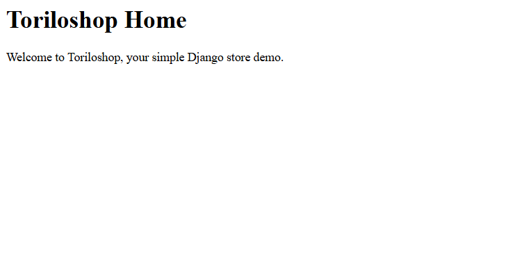
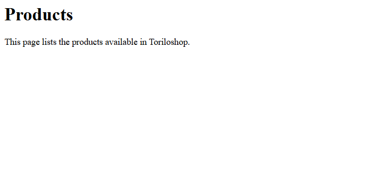
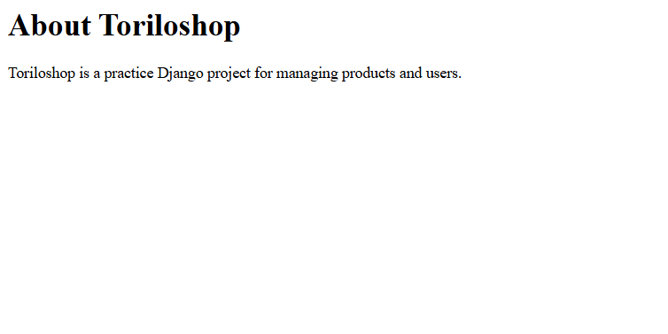
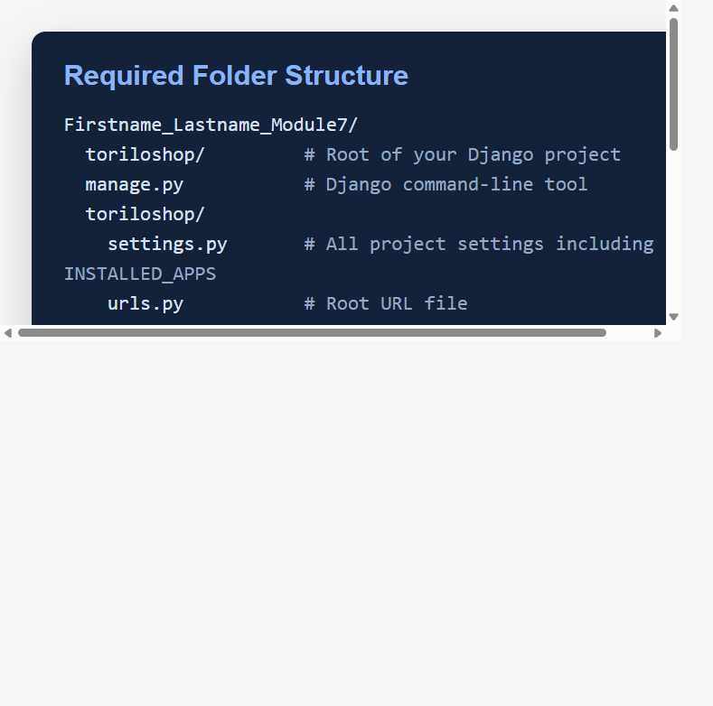

# Toriloshop

Toriloshop is a simple Django practice project for a small shop site. It demonstrates basic app setup, URL routing, and simple HTTP responses for a home page, product list page, and about page.

## Features Implemented

- `home()` at `/`
- `product_list()` at `/products/`
- `about()` at `/about/`
- `products` and `users` registered in `INSTALLED_APPS`
- **Cloudinary integration for image uploads on Render.com**

## Setup Instructions

1. Create and activate a virtual environment.
2. Install dependencies: `pip install -r requirements.txt`
3. Create a `.env` file with the following variables:
   ```
   SECRET_KEY=your-secret-key
   DEBUG=True
   DATABASE_URL=your-database-url
   CLOUDINARY_CLOUD_NAME=your-cloud-name
   CLOUDINARY_API_KEY=your-api-key
   CLOUDINARY_API_SECRET=your-api-secret
   ```
4. Run migrations: `python manage.py migrate`
5. Start the server: `python manage.py runserver`
6. Open the pages in a browser:
   - `http://127.0.0.1:8000/`
   - `http://127.0.0.1:8000/products/`
   - `http://127.0.0.1:8000/about/`

## Render.com Deployment

1. **Create a Cloudinary account** at https://cloudinary.com/
2. **Get your Cloudinary credentials** from the dashboard:
   - Cloud Name
   - API Key
   - API Secret
3. **Add these environment variables** in Render.com:
   - `CLOUDINARY_CLOUD_NAME`
   - `CLOUDINARY_API_KEY`
   - `CLOUDINARY_API_SECRET`
4. **Run migrations** after deployment to apply the model changes

## Screenshots









## Notes

The `users` app is included as required by the assignment and is ready for future user-related views or models.

**Important:** Product images are stored on Cloudinary, not locally. This ensures images persist across Render.com deployments.
